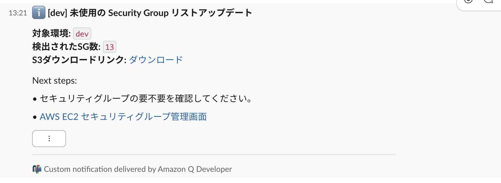
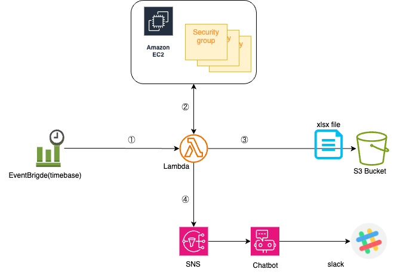

## Unused Security Groups Checker

**定期的に未使用の Security Group を検出し、S3 にエクスポート&Slack に通知する** ツールです。

 ---

### 機能概要

-  未使用の Security Group（SG）を自動検出

-  S3 にエクセルファイル（.xlsx）として出力

-  EventBrigdeにより毎月1日0時(JST)に実行

-  AWS Chatbot 経由で Slack に通知

-  AWS SAM によるデプロイ

### 前提

- 通知先のslack chatbotがすでに作成済みであること。

---

### デプロイ手順
  

**1. AWS SAM のセットアップ**

```
brew install aws-sam-cli  # Macの場合
sam --version  # SAM CLI のバージョン確認
```

**2. 環境変数の設定**

  
makefile.template をコピーして、環境に合わせたmakefileを作成。

指定する必要がある変数

```
(ENV)_S3_BUCKET  出力先のS3バケット
(ENV)_S3_PREFIX  出力先のS3プレフィックス
```

また、定期実行間隔を調整する場合には以下を修正

デフォルトは毎月1日0時(JST)

template.yaml

```
    Schedule: cron(0 15 1 * ? *)  # JST 0:00 (UTC 15:00)
```


**3. デプロイ**

```
make deploy-dev   # 開発環境の場合
```

**4. Chatbot -> SNS連携**

事前にslack連携済みのChatbotの通知設定にて、今回作成したSNSトピックを追加する。

---
### プロジェクト構成

```
.
├── app.py                # メインの Lambda スクリプト
├── template.yaml         # AWS SAM テンプレート
├── requirements.txt      # 依存ライブラリ一覧
├── makefile.template     # ビルド・デプロイ用の Makefile テンプレート
└── README.md             # ドキュメント
```

---
### 設定


**Lambda の環境変数**

 -  S3_BUCKET
	   -  SGリストを格納する S3 バケット名

 -  S3_PREFIX
	   -  SGリストを格納する S3 プレフィックス名
	 
  - ENV
	  - 環境 (dev, prod など)

- SNS_TOPIC_ARN
	- AWS Chatbot 用の SNS トピック ARN

### S3 の出力パス例

```
s3://{S3_BUCKET}/{S3_PREFIX}/{YYYY-MM-DD}-{ENV}-Unused-SG.xlsx
```

### Slack 通知

Slack には AWS Chatbot 経由で通知されます。

通知例：

```
[dev] 未使用の Security Group リストアップデート
対象環境: dev
検出されたSG数: 13
S3ダウンロードリンク: ダウンロード(link URL）
```




---
### 使用技術

•  AWS Lambda (Python 3.12)

•  AWS SAM

•  Amazon S3

•  Amazon SNS

•  AWS Chatbot

•  Slack API

---
### 構成図



---
### ライセンス

This project is licensed under the MIT License - see the [LICENSE](LICENSE) file for details.
